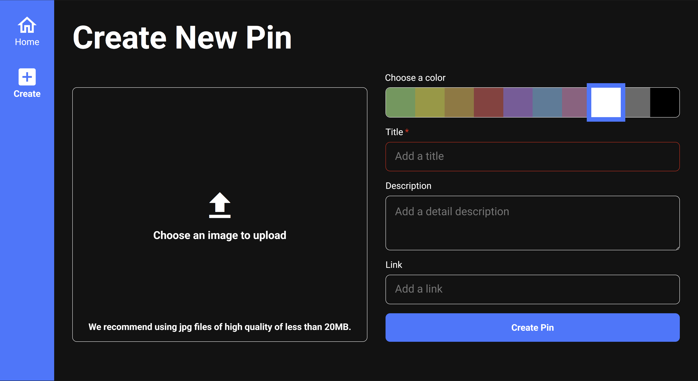
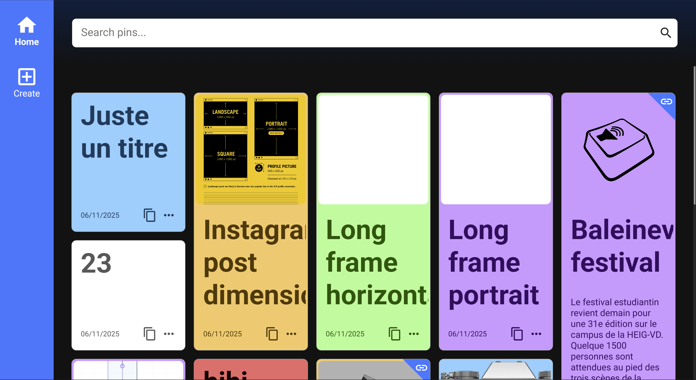
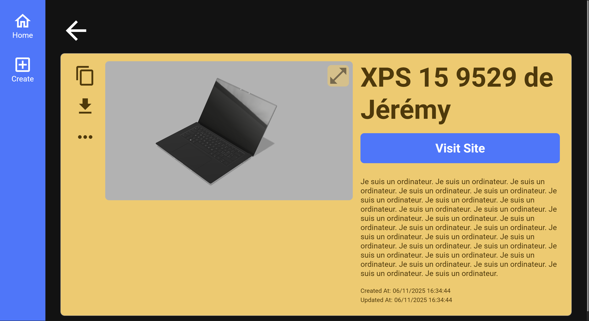
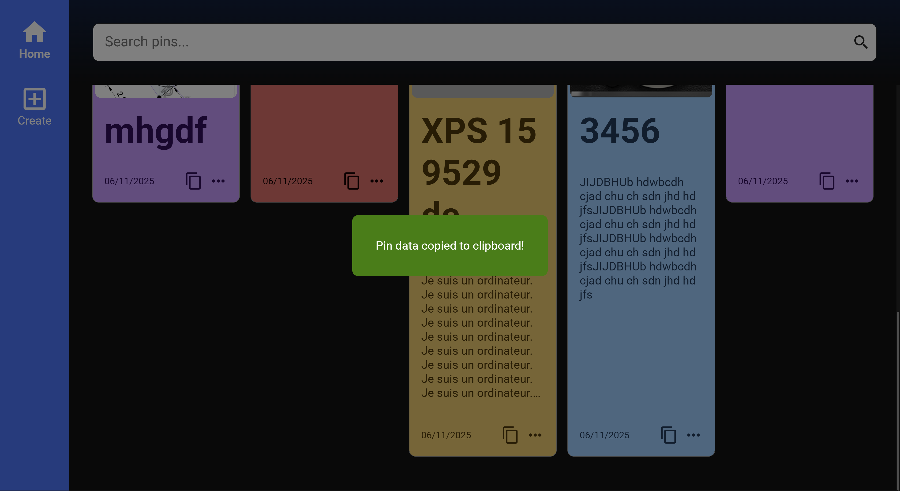
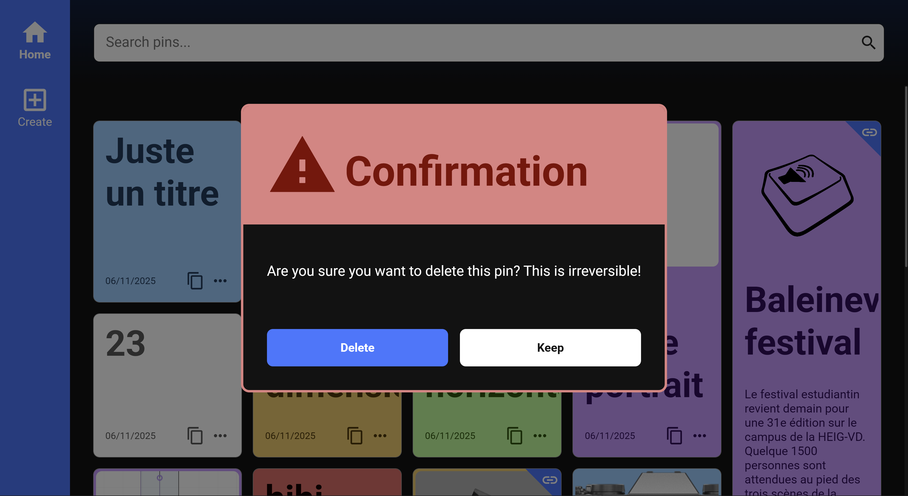

# Assignement 01
| School Information | Author |
|-------------------|--------|
| **School:** Scuola universitaria professionale della Svizzera italiana (SUPSI) | **Name:** Jérémy Martin |
| **Cursus:** MAInD Master SUPSI in Interaction Design | **Date:** 06.11.2025 |
| **Course:** 2025/26 Creative Coding Foundations | |

## Installation
Prerequisites
- Node.js 18+ and npm
- A modern browser (IndexedDB support)

Setup
1. Install dependencies
	```pwsh
	npm install
	```
2. Start the dev server (Parcel) with hot reload at http://localhost:1234
	```pwsh
	npm run start
	```
3. Build for production (outputs to `dist/`)
	```pwsh
	npm run build
	```
4. Preview the production build locally
	```pwsh
	npm run serve
	```

Notes
- Parcel is the zero-config bundler used here. It compiles modern JS, resolves imports, serves in dev with HMR, and outputs an optimized production bundle.
- The `clean` script uses a POSIX-style `rm -rf`. On Windows PowerShell, use Git Bash for that step, or install `rimraf` and replace the script with `rimraf .parcel-cache dist` if needed.

## Brief
Starting from the concept of a pinboard, implement a web page that:
- is responsive (properly layout for smartphone, tablet, and desktop)
- allows the user to add and remove elements
- allows the user to coustomize elements (i.e. colors, size)
- allows the switch between two views (at least)

- 2 screenshots of the final result (interaction)
- Short project description (general concept, functional logic and interaction modalities, 300 characters)
- Block diagram (flow, con [draw.io](http://draw.io), export in svg)
- Lista funzioni (name of the function, arguments, description, what it returns)
- Content and data sources (link)
- API documentation (if any)

## Project description
Capture visual notes fast. Add a title (required), drop in an image, pick a color, and optionally add a description and a link. Your pins appear on a clean, searchable board.
Open one to focus on the image, visit the linked site, see timestamps, or make quick edits. Designed to keep small research snippets and inspirations in one place.

### Key Features
- Create pins. Upload an image, choose a color, enter a title, and optionally add description and link. 
- Searchable board. Find pins via the search bar.
- Pin details view. Open a pin to view the image, the complete text, the link if exists, and see created/updated timestamps. 
- Edit anytime. Update color, title, description, link, or image. 
- One-click copy. Copy a pin’s data to your clipboard and get immediate confirmation via a toast message. 
- Protected deletions. Confirm before removing a pin to avoid mistakes (see confirm-dialog-computer.png). 
- Persistent storage. All pins are saved in a local database on your device.

## Project diagram
### Structure



### Home (Pins) MVC flow overview



## API documentation
This project ships a small IndexedDB wrapper at `src/indexed-db.js` (Model layer) to manage pins.

Database
- Name: `pinboard_db`
- Version: `1`
- Store: `pins` (keyPath: `id`, autoIncrement)
- Indexes: `title`, `description`, `color`, `createdAt`, `updatedAt`

Pin object shape
```ts
type Pin = {
	id?: number;            // auto-assigned
	title: string;          // required
	color: string;          // required (maps to CSS variables)
	description?: string;
	image?: Blob | File;    // optional, stored as Blob
	link?: string;          // optional, auto-prepends http:// when missing in view
	createdAt?: string;     // ISO string set by the model
	updatedAt?: string;     // ISO string set by the model
}
```

Public API (all return Promises)
- `addPin(pin: Pin): Promise<number>`
	- Validates `title` and `color`, sets timestamps, stores, resolves with new id.
- `updatePin(pin: Required<Pin>): Promise<number>`
	- Validates, updates `updatedAt`, replaces existing record by key.
- `getPin(id: number): Promise<Pin | undefined>`
	- Fetch a single pin by id.
- `getAllPins(): Promise<Pin[]>`
	- Fetch all pins.
- `textSearchPins(query: string): Promise<Pin[]>`
	- Iterates pins and matches `title` or `description` (case-insensitive).
- `deletePin(id: number): Promise<void>`
	- Delete by key.
- `clearPins(): Promise<void>`
	- Remove all records in the store.
- `CheckDbInitialization(): Promise<void>`
	- Ensures DB is opened; called internally and once at module load.

Usage examples
```js
import { addPin, getAllPins, textSearchPins } from './src/indexed-db.js';

await addPin({ title: 'Idea', color: 'yellow', description: 'Try layout', link: 'example.com' });
const all = await getAllPins();
const hits = await textSearchPins('idea');
```

Error handling
- Methods reject on IndexedDB request errors; UI surfaces errors via `textDialog`.
- `addPin`/`updatePin` throw if required fields are missing.

Performance notes
- Images are kept as Blobs; views use `URL.createObjectURL(blob)` for rendering.
- Text search currently scans all records (cursor). For large datasets, consider index-backed queries.